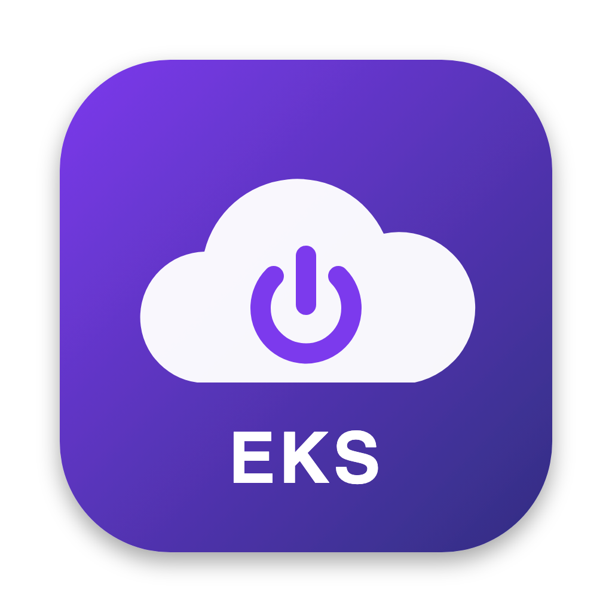

# mac-shortcuts-app

A Dock app, a command-line script and macOS Shortcuts for running an EKS lab cluster
without leaving it billing overnight.



## EKS Lab.app

Click it in the Dock and you get one tab per panel (`EKS lab`, `Mail triage`,
`Demo laptop`, …), each with a live status dot so a section needing attention shows it
without being open. The selected tab is remembered across launches. On the EKS tab:

- a **connection pill**: green when your AWS SSO session is valid, red with a **Sign in**
  button that runs `aws sso login --profile <your profile>` and waits for the browser
- a **status card**: platform nodes, GPU nodes and the cost per hour, refreshed every 20 s
- **Start EKS** (platform nodes, waits until the agentgateway UI answers), **Start with GPUs**,
  **Stop GPUs only** and **Stop EKS** (every node group to 0, control plane stays, asks first)
- **Demo console**: opens the local demo console, starting it with `./run.sh` if it is down
- **agentgateway (EKS) UI** link and a log button

Every action runs `eks-lab` in the background and posts a macOS notification when it is done.

## Install

```bash
./install.sh            # script to ~/.local/bin, app to ~/Applications, adds it to the Dock
$EDITOR ~/.config/eks-lab/config
```

Needs the AWS CLI, kubectl and the Xcode command line tools (`xcode-select --install`).

## eks-lab

```bash
eks-lab status          # node groups, billing instances, every running instance
eks-lab up              # platform nodes, waits for the agentgateway UI
eks-lab gpu-up          # up, then the GPU node group (gpu.sh up)
eks-lab gpu-down        # GPU node group to 0
eks-lab down            # every node group to 0; waits until EC2 shows nothing billing
eks-lab login           # aws sso login for the configured profile
eks-lab console         # open the demo console, starting it if needed
eks-lab up --background # return at once, notify when done (what the app and Shortcuts use)
```

Stop never trusts the node group's status: PodDisruptionBudgets can stall a drain while
the instances keep billing, so it waits until EC2 reports no instances for the cluster.
Only one start or stop runs at a time. Log: `~/Library/Logs/eks-lab.log`.

## Shortcuts

`shortcuts/` has signed **Start EKS**, **Start EKS with GPUs**, **Stop EKS GPUs** and
**Stop EKS**. Double-click to import, then turn on **Settings → Advanced → Allow Running
Scripts** in Shortcuts. They appear in the Shortcuts menu-bar icon and work with Siri.

## Adding commands (commands.json)

The window is built from `app/commands.json`. Edit it and run `./build.sh`; the file is copied
into the app bundle, so new panels and buttons appear on the next launch. Each panel is one
tab in the window, with the panel's symbol, title and status colour in the tab strip.

```jsonc
{
  "title": "Lab",                     // window title
  "refreshSeconds": 20,               // how often every status script runs
  "panels": [{
    "title": "Mail triage",
    "symbol": "envelope.badge.fill",  // any SF Symbol name (SF Symbols.app lists them)
    "tint": "teal",                   // green red orange purple pink yellow teal indigo mint cyan brown gray blue
    "cwd": "~/code/mail-triage",      // working directory for every script in the panel
    "status": "./service.sh state-json",   // optional, see below
    "log": "~/code/mail-triage/logs/triage.log",  // optional, adds a log button
    "commands": [{
      "title": "Deploy", "detail": "second line", "symbol": "arrow.triangle.2.circlepath", "tint": "indigo",
      "run": "./service.sh deploy",   // any bash; PATH includes Homebrew and ~/.local/bin
      "wait": false,                  // false (default): runs detached, output to the app log, notification when done
                                      // true: the app waits for it, then refreshes the status
      "style": "button",              // or "link" for a small pill in the row under the buttons
      "check": "curl -sf localhost:8900",   // links only: exit 0 shows a green dot, otherwise red
      "disableWhen": ["busy", "error"],     // status states that grey the command out
      "confirm": { "title": "Sure?", "message": "…", "button": "Deploy" }  // ask first
    }]
  }]
}
```

A **status** script prints one JSON object:

```json
{"state": "ok", "text": "Running", "detail": "second line", "subtitle": "under the panel title",
 "badge": "$0.97", "badgeCaption": "per hour", "action": {"title": "Sign in", "run": "eks-lab login"}}
```

`state` sets the colour: `ok` green, `hot` pink, `busy` orange, `warn` yellow, `error` red, `off` grey.
`action` adds a red pill in the panel header (the EKS panel uses it for AWS sign-in).
`eks-lab state-json` and mail-triage's `./service.sh state-json` are the two examples.

Output of detached commands goes to `~/Library/Logs/mac-shortcuts-app.log` (terminal icon, top right).

## Mail triage panel

Drives `~/code/mail-triage/service.sh`: **Run now** (checks new mail at once: restarts the daemon, or a one-off `triage run` when paused or stopped), **Start** (installs and loads the launchd agent),
**Stop** (unloads it; it comes back at next login, `./service.sh uninstall` stops it for good),
**Deploy** (`uv sync --frozen`, checks `triage` starts, re-copies the plist and reloads it),
plus Pause 2h / Resume and a Gmail link.

## Changing the app

Edit `app/EKSLab.swift` and run `./build.sh`. To check the layout without clicking anything
(runs every status script once, renders, exits):

```bash
"$HOME/Applications/EKS Lab.app/Contents/MacOS/EKSLab" --snapshot /tmp/a.png dark
# add --config path/to/other.json to try a config without rebuilding
```

The icon is `icon/icon.html`, rendered with headless Chrome and packed with `iconutil`.
